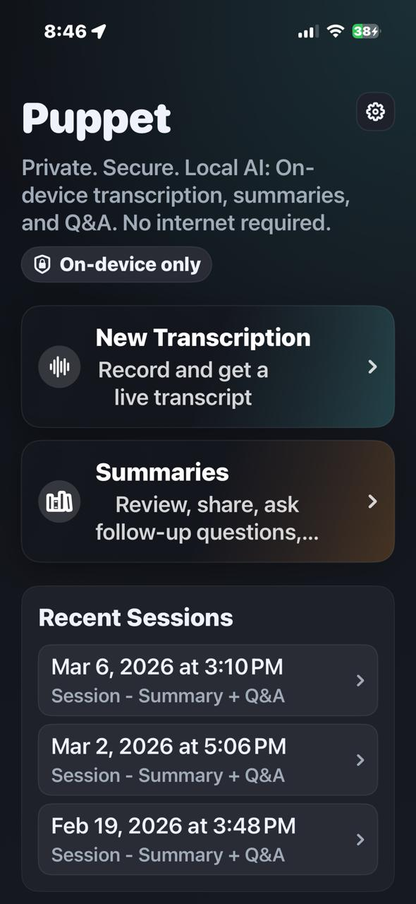
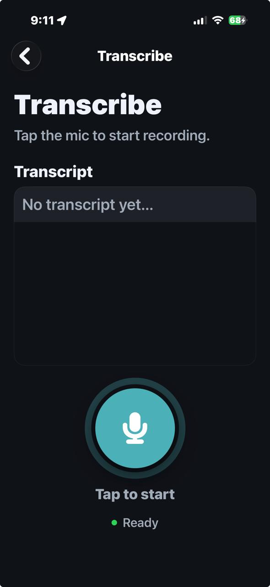
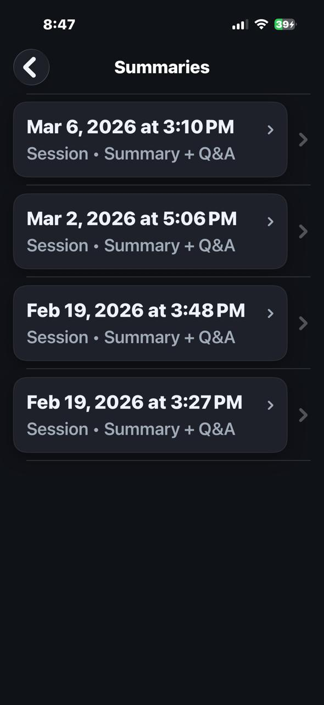
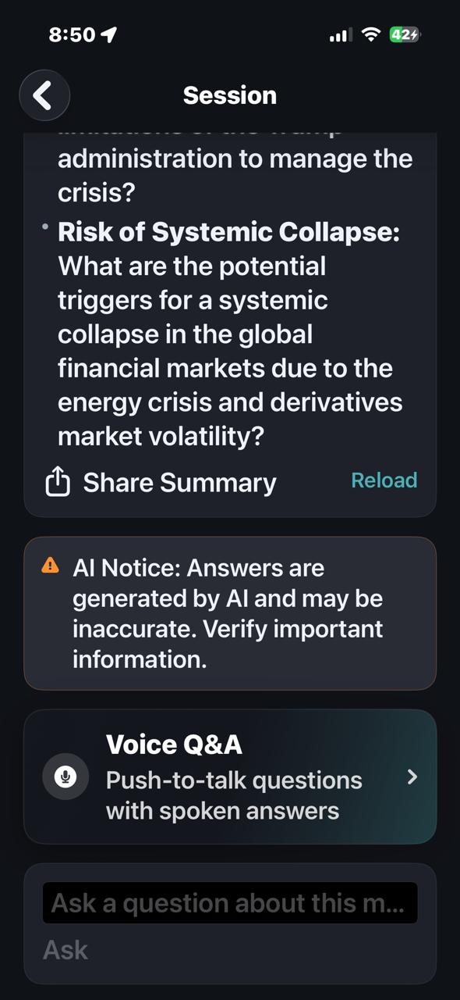
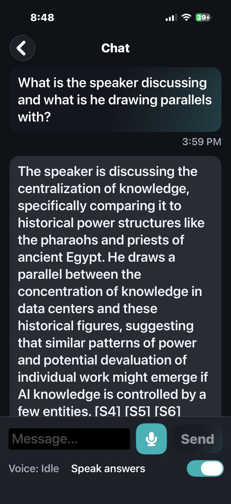

# Puppet for iOS

Local-first iPhone app for:
- meeting transcription
- smart summaries
- grounded Q&A over saved meetings
- push-to-talk voice Q&A

This repo is a **working prototype / evolving MVP** for an on-device meeting assistant. It is not a polished App Store release.

If you care about:
- local-first AI product design
- privacy-preserving UX
- multi-model mobile inference
- grounded Q&A over user-created artifacts
- SwiftUI apps that do real model work on-device

…this repo should be interesting.

---

## Current status

**Working, but still under active iteration.**

Current baseline includes:
- live meeting transcription
- saved session history
- smart summaries
- typed Q&A over a saved meeting
- push-to-talk Voice Q&A
- spoken answers
- summary sharing
- local session deletion

Still in flux:
- UX polish
- audio performance
- some model/runtime choices
- tuning and latency work

Important practical caveat:
- **audio is currently lagging in parts of the experience**
- the app works best on **newer iPhones**
- current known test baseline: **tested on iPhone 14 Pro**
- audio/runtime optimization is still unfinished and may be revisited later

---

## What the app does

Puppet is built around **saved meeting sessions**.

High-level flow:
1. record a meeting
2. generate a transcript
3. persist a local session
4. generate a summary
5. reopen the session later
6. ask typed or voice follow-up questions against the saved artifacts

The core workflow is intended to stay on-device:
- audio capture
- transcription
- summary generation
- retrieval / grounding
- spoken-answer generation

Artifacts stay local unless the user explicitly exports/shares them.

---

## Screens

### Home
Launch point for the app:
- start a new transcription
- open saved summaries
- reopen recent sessions
- access settings



### Transcribe
Live recording + transcript screen:
- record meeting audio
- show live transcript updates
- pause / resume capture
- stop to save session + trigger summary generation



### Summaries
Saved session library:
- browse sessions
- reopen a meeting
- delete a meeting from local storage



### Session / Smart Summary
Main session review screen:
- read the generated summary
- share summary text
- ask typed follow-up questions
- jump into voice Q&A



### Voice Q&A / Chat
Meeting-specific chat view:
- type a question
- or hold to record a voice question
- retrieve meeting evidence
- return a grounded answer
- optionally speak the answer back

Current state of Voice Q&A:
- voice input works: you can press, ask a question, and get an answer back
- the **text answer path is currently more responsive than the spoken-answer path**
- spoken voice response is **not fully optimized yet** and can lag behind the text response
- in practice, Voice Q&A is usable now, but the audio reply experience still needs performance work

#### Voice Q&A pipeline
Current voice flow is:
1. push-to-talk audio capture
2. ASR with `LFM2.5-Audio-1.5B-Q8_0`
3. retrieval from the saved meeting session (transcript + summary chunks)
4. grounded answer generation with `LFM2-1.2B-RAG-Q5_K_M`
5. optional spoken reply using `LFM2.5-Audio-1.5B-Q8_0`

Short version:
- **voice in:** `LFM2.5-Audio-1.5B-Q8_0`
- **answer generation:** `LFM2-1.2B-RAG-Q5_K_M`
- **voice out:** `LFM2.5-Audio-1.5B-Q8_0`



---

## Technical architecture

The app is intentionally **multi-model**.
It does not try to force one model to do everything.

Different tasks have different constraints:
- audio transcription
- text summarization
- grounded answer generation
- spoken answer synthesis

Separating those concerns makes the app easier to reason about and improves runtime control on-device.

### Model roles

#### ASR / speech recognition
- `LFM2.5-Audio-1.5B-Q8_0`

Used for:
- live meeting transcription
- voice question transcription

#### Summarization
Primary:
- `LFM2-2.6B-Transcript-Q_4_k_m`

Fallback:
- `LFM2-2.6B-Transcript-Q4_K_M`

Used for:
- meeting summary generation

#### Grounded Q&A / RAG
- `LFM2-1.2B-RAG-Q5_K_M`

Used for:
- typed Q&A
- answer generation in Voice Q&A

#### Spoken answers / TTS
Primary model path:
- `LFM2.5-Audio-1.5B-Q8_0`

Fallback path:
- Apple speech synthesis

Used for:
- spoken reply playback

### Why the split matters

This split helps with:
- task-specific quality
- clearer orchestration
- memory pressure management
- isolating audio vs text model behavior
- making future experiments more targeted

---

## Runtime design notes

A few implementation choices matter a lot in this repo:

### 1) Meeting sessions are first-class
The app is not just a transient recorder.
A meeting becomes a persisted session with reusable artifacts.

That enables:
- summary review later
- follow-up Q&A later
- local retrieval over transcript + summary
- session-scoped storage and cleanup

### 2) Retrieval is session-scoped
Q&A is grounded against saved meeting artifacts, not a generic global knowledge base.

That keeps the product behavior closer to:
- “answer from this meeting”
not
- “hallucinate from whatever the model thinks.”

### 3) Models are actively managed
The runtime unloads/swaps models to keep device memory sane.

This matters because on-device inference on phones is constrained enough that:
- model isolation matters
- staging/resource resolution matters
- audio and text paths should not accidentally bleed into each other

### 4) Bundle/resource resolution needs care
iOS/Xcode resource handling can be messy, especially for local model assets.

The code is written to tolerate bundle path variation and resource flattening, rather than assuming one perfect folder layout at runtime.

---

## Main flows

### Record → Save → Summarize
1. Start a transcription.
2. Capture audio locally.
3. Show live transcript updates.
4. Stop recording.
5. Persist a new meeting session.
6. Write placeholder summary artifacts.
7. Generate summary.
8. Re-index the meeting for later Q&A.

### Reopen → Ask
1. Open a saved session.
2. Load summary/transcript artifacts.
3. Retrieve relevant meeting evidence.
4. Generate a grounded answer.
5. Optionally speak the answer.

### Voice Q&A
1. Enter the Chat screen for a specific session.
2. Hold to record a question.
3. Transcribe voice input locally.
4. Retrieve meeting evidence.
5. Generate answer.
6. Speak it back if enabled.

---

## Repo layout

```text
meeting-transcriber/
├── MeetingPrompterIOS/
│   ├── App/
│   │   └── ViewModels/
│   ├── Core/
│   │   ├── AI/
│   │   ├── Audio/
│   │   └── Storage/
│   ├── Retrieval/
│   ├── Views/
│   └── Resources/
├── docs/
│   ├── screenshots/
│   └── app-spec-current.md
├── README.md
├── QUICKSTART.md
├── SETUP.md
└── MVP.md
```

---

## Where to look in code

If you are trying to understand or extend the app, these are the best entry points.

### UI / screen flow
- `MeetingPrompterIOS/Views/HomeView.swift`
- `MeetingPrompterIOS/Views/RecordView.swift`
- `MeetingPrompterIOS/Views/SessionsListView.swift`
- `MeetingPrompterIOS/Views/SessionView.swift`
- `MeetingPrompterIOS/Views/ChatView.swift`
- `MeetingPrompterIOS/Views/Settings/SettingsView.swift`

### View models / app behavior
- `MeetingPrompterIOS/App/ViewModels/MainViewModel.swift`
- `MeetingPrompterIOS/App/ViewModels/SessionViewModel.swift`
- `MeetingPrompterIOS/App/ViewModels/ChatViewModel.swift`

### Model loading / orchestration
- `MeetingPrompterIOS/Core/AI/ModelIDs.swift`
- `MeetingPrompterIOS/Core/AI/LeapModelManager.swift`
- `MeetingPrompterIOS/Core/AI/ASRService.swift`
- `MeetingPrompterIOS/Core/AI/SummarizationService.swift`
- `MeetingPrompterIOS/Core/AI/RAGService.swift`
- `MeetingPrompterIOS/Core/Audio/ModelTTSService.swift`

### Storage / retrieval
- `MeetingPrompterIOS/Core/Storage/FileStore.swift`
- `MeetingPrompterIOS/Core/Storage/MeetingSession.swift`
- `MeetingPrompterIOS/Retrieval/SearchIndex.swift`

### Supporting logic
- `MeetingPrompterIOS/Core/RAG/QuestionDetector.swift`
- `MeetingPrompterIOS/Views/Markdown/MarkdownRenderer.swift`

---

## Contributor notes

### If you update docs
Prefer this order:
1. inspect current code
2. inspect current model IDs
3. inspect current screen flow
4. then update docs

Do not trust older notes over runtime behavior.

### If you touch model config
Check these first:
- `ModelIDs.swift`
- `LeapModelManager.swift`

Be careful about:
- asset names
- bundle/resource paths
- audio companion files
- assumptions carried over from older experiments

### If you work on Voice Q&A
Pay attention to:
- capture path isolation
- ASR latency
- model load/unload behavior
- interaction with ongoing meeting recording state
- speech fallback behavior

### If you work on performance
Most promising areas are probably:
- audio latency
- model warmup/loading behavior
- staged resource handling
- reducing avoidable model churn
- device-specific tuning on newer vs older iPhones

---

## Privacy / local-first behavior

The project is built around keeping meeting artifacts on-device.

Artifacts can include:
- recorded audio
- transcript text
- summary text / Markdown
- local retrieval/index data
- generated answer-audio artifacts

Normal use does **not** require cloud inference.

Data only leaves the device when the user explicitly exports/shares something.

See also:
- `MeetingPrompterIOS/Resources/Legal/PRIVACY.md`
- `MeetingPrompterIOS/Resources/Legal/EULA.md`
- `MeetingPrompterIOS/Resources/Legal/THIRD_PARTY_NOTICES.md`

---

## Tech stack

- **SwiftUI**
- **LeapSDK**
- **AVFoundation**
- **SQLite / GRDB / FTS**
- Markdown rendering for summaries

---

## License and model assets

### Code license
The source code in this repository is licensed under the **MIT License**.
See [`LICENSE`](LICENSE).

### Third-party model/license note
The app depends on third-party model assets and libraries that are **not** covered by the MIT license for this repo.
In particular, Liquid AI / LFM model usage remains subject to the applicable upstream license terms.

See also:
- `MeetingPrompterIOS/Resources/Legal/THIRD_PARTY_NOTICES.md`
- `MeetingPrompterIOS/Resources/Legal/EULA.md`

### Where to get the required models
This repo intentionally does **not** ship large model binaries in git.
To run the app, you will need to obtain the required model assets separately and add them to the Xcode target / app bundle.

Current in-code model IDs are defined in:
- `MeetingPrompterIOS/Core/AI/ModelIDs.swift`

Model families used by the app:
- **Liquid AI / LFM models** for ASR, summarization, grounded Q&A, and audio reply generation

Useful upstream links:
- Liquid AI: <https://www.liquid.ai/>
- Liquid Foundation Models on Hugging Face: <https://huggingface.co/LiquidAI>
- Leap iOS SDK: <https://github.com/Liquid4All/leap-ios>

Before bundling or redistributing any model assets, check the upstream terms for the exact model you are using.

---

## Related docs

- `QUICKSTART.md` — shortest path to getting it running
- `SETUP.md` — setup details
- `MVP.md` — current baseline summary
- `docs/app-spec-current.md` — readable behavior/spec snapshot

---

## Source of truth

When docs, notes, or old history disagree, trust the current code first:
- `MeetingPrompterIOS/Core/AI/ModelIDs.swift`
- `MeetingPrompterIOS/Core/AI/LeapModelManager.swift`
- `MeetingPrompterIOS/App/ViewModels/`
- `MeetingPrompterIOS/Views/`

Then update the docs.
